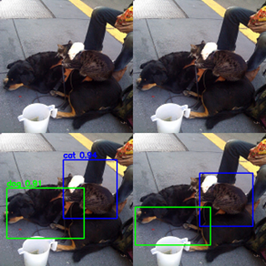

# Single Shot Detector (SSD) – Object Detection Implementation

This project implements a simplified **Single Shot MultiBox Detector (SSD)** from scratch using PyTorch.
The model is trained to detect three foreground object classes:

* **Cat**
* **Dog**
* **Person**

The system includes model training, validation with mAP evaluation, test set prediction export, and inference on custom images.

---

## Project Overview

This implementation includes:

* Custom SSD network architecture
* Anchor (default box) generation
* Multi-task loss (classification + localization)
* Non-Maximum Suppression (NMS)
* mAP and Precision-Recall evaluation
* Visualization of ground-truth and predictions
* Inference on real-world custom images

The model is trained on a COCO-style dataset with bounding box annotations.

---

## Detection Results



## Model Architecture

The SSD model predicts:

* Class probabilities for each anchor box
* Bounding box offsets for localization

### Key components:

* Feature extraction backbone
* Multi-scale feature maps
* Default box (anchor) generator
* Classification + regression heads
* Loss function combining:

  * Cross-entropy loss (classification)
  * Smooth L1 loss (localization)

---

## Dataset Format

Each annotation file follows:

```
<class_id> <x> <y> <w> <h>
```

Where:

* `(x, y)` = top-left corner (pixel coordinates)
* `(w, h)` = width and height
* Images are resized to **320×320**
* Bounding boxes are scaled and normalized to `[0, 1]`

---

## Directory Structure

```
project_root/
│
├── main.py                  # Training / validation / testing
├── model.py                 # SSD model definition
├── dataset.py               # Dataset loader + default box generator
├── utils.py                 # Loss, NMS, decoding, visualization
├── run_custom_images.py     # Inference on external images
├── run.sh                   # Run script
├── network.pth              # Trained model checkpoint
├── README.md
├── requirements.txt
│
├── custom_data/             # Custom images for inference
├── predictions/             # Test set predictions (auto-generated)
├── viz/                     # Training/validation visualizations
└── viz_custom/              # Custom image detection results
```

---

## How to Run

### 1. Train + Validate + Test

Run:

```
python main.py
```

This will:

* Load training and validation datasets
* Train the SSD model
* Evaluate mAP on validation set
* Plot Precision-Recall curves
* Generate predictions on the test set
* Save outputs in `predictions/`
* Optionally create visualizations in `viz/`

Training hyperparameters (learning rate, batch size, epochs, etc.) can be adjusted inside `main.py`.

---

### 2. Run Test Only

```
python main.py -test
```

---

### 3. Run Detection on Custom Images

Make sure `network.pth` exists in project root, then run:

```
python run_custom_images.py
```

This will:

* Load trained model
* Read images from `custom_data/`
* Run object detection
* Apply NMS
* Draw bounding boxes + labels + confidence scores
* Save outputs to `viz_custom/`

---

## Default Box Generation

Anchors are generated using:

```
layers = [10, 5, 3, 1]
large_scale = [0.2, 0.4, 0.6, 0.8]
small_scale = [0.1, 0.3, 0.5, 0.7]
```

These create multi-scale anchor boxes for robust object detection across different object sizes.

---

## Loss Function

The SSD loss combines:

* Classification loss (Cross-Entropy)
* Localization loss (Smooth L1)

Optional per-class weighting can be applied to address class imbalance.

---

## Post-Processing

`non_maximum_suppression()` performs per-class NMS on decoded bounding boxes and removes redundant detections.

Outputs:

* Filtered confidence scores
* Final bounding boxes in normalized coordinates

---

## Evaluation

* mAP is computed on validation set
* PR curves are generated for:

  * Cat
  * Dog
  * Person
* Background class is excluded from evaluation

---

## Technical Stack

* Python
* PyTorch
* NumPy
* Matplotlib
* Custom implementation of SSD components

---

## Results

* Model successfully detects cat, dog, and person classes.
* For custom images, a confidence threshold of **0.8** produced the best visual results.
* Predictions are exported in text format for quantitative evaluation.

---

## Notes

* GPU is recommended for training.
* CPU execution requires modifying CUDA-related lines in `main.py`.
* Paths inside scripts may need updating depending on dataset layout.
* `network.pth` must exist before running inference.

---

## Author

Yicheng Lin
Master of Computer Science
Focus: Computer Vision & Machine Learning

---

## Future Improvements

* Hard negative mining
* Data augmentation strategies
* Backbone replacement (ResNet / MobileNet)
* Real-time performance optimization
* Deployment to edge devices

---
